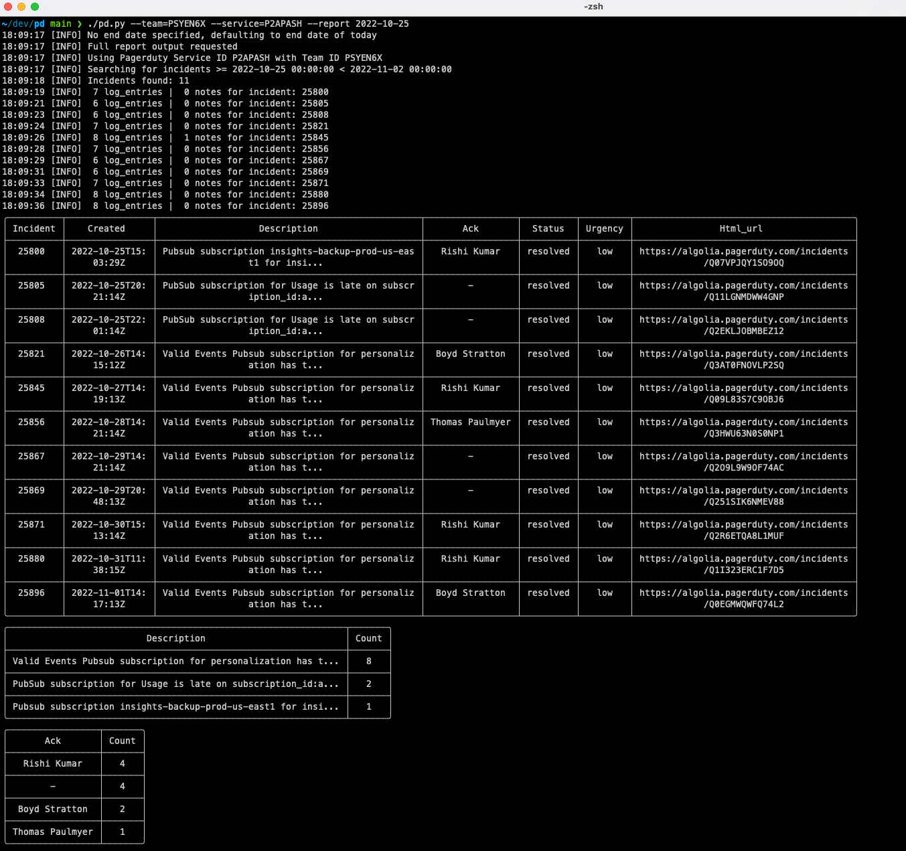

# PD

Simple script to read and group PagerDuty Incidents

### Setup

Add a Pagerduty API key to `~/.pd` or use flag `--key='<your key>'`

### Help

`./pd.py -h`

### Example

`./pd.py -t PSYEN6X -s P2APASH --report 2022-10-25`

